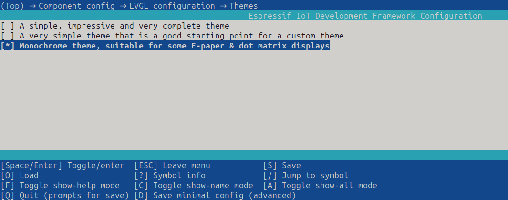

# lv_port_esp32_squareline_studio

## Overview
This repository can be used to generate SquareLine Studio boards for ESP32 devices
(connected to supported display drivers defined in [lvgl_esp32_drivers](https://github.com/hiruna/lvgl_esp32_drivers/tree/develop/lvgl_7.11.0_idf_5.0)).

Project structure in _[\__ui_project_name\__](./__ui_project_name__)_ follows a similar structure to
[lv_port_esp32](https://github.com/hiruna/lv_port_esp32/tree/develop/lvgl_8.3.7_idf_5.2).
### Tested Library Versions
* ESP-IDF
  * v5.2 [master](https://github.com/espressif/esp-idf/tree/master/)
* `lvgl_esp32_drivers`
  * https://github.com/hiruna/lvgl_esp32_drivers/tree/develop/lvgl_7.11.0_idf_5.0
* LVGL
  * [release/v8.3](https://github.com/lvgl/lvgl/tree/release/v8.3)

### Boards
| Board Name                                            | Driver  | Image                                                           | Example                                                                                                                               |
|-------------------------------------------------------|---------|-----------------------------------------------------------------|---------------------------------------------------------------------------------------------------------------------------------------|
| [esp32_ssd1306_128x64](./boards/esp32_ssd1306_128x64) | SSD1306 |  |  <br/> [Source Files](./examples/esp32_ssd1306_128x64) |


## Create a new board
Refer to https://docs.squareline.io/docs/obp.

1. Clone this repo
2. Create a new directory under [boards/](./boards)
   *  Example: `your_board_name/`
4. Add the `your_board_name.png` file
   * A photo of the board to be displayed in SquareLine Studio.
6. Add the `your_board_name.slb`
   * SquareLine board definition file (see https://docs.squareline.io/docs/obp#your_boardslb for more information)
     * For monochrome displays such as the SSD1306 OLED panel, keep the `color_depth` at `8`, SquareLine currently
       does not support depth < 8. You will need to fix this, [see below](#monochrome-display-lv_color_depth-assertion-error).
     * Set the `lvgl_export_path` to `false` as the submodule reference _[\__ui_project_name\__/components/lvgl](./__ui_project_name__)_ is used
     * Set the `pattern_match_files` to `CMakeLists.txt,main/main.c` as this will replace templated tags such as `__UI_PROJECT_NAME__`
     * Set the `ui_export_path` to `./components/ui`
     * Set the `supported_lvgl_version` to `8.3.*`
7. Copy `your_board_name/` directory to the SquareLine installation's `boards/Espressif` directory
8. Create a compressed ZIP file of the _[\__ui_project_name\__](./__ui_project_name__)_ directory
   * This is common to all supported display drivers in [lvgl_esp32_drivers](https://github.com/hiruna/lvgl_esp32_drivers/tree/develop/lvgl_7.11.0_idf_5.0)
9. Rename the ZIP file to `your_board_name.zip`
10. Copy the `your_board_name.zip` to SquareLine installation's `boards/Espressif/your_board_name` directory

## Create a new SquareLine Studio Project
1. Once you have created a new board (or used one of the existing boards in this repo), open SquareLine Studio.
2. The board you've created will appear in SquareLine Studio.
   * _Example of the [ESP32 SSD1306 128x64 OLED](./boards/esp32_ssd1306_128x64) "board"_ is shown below.

       
3. Set your project settings and create the project
   * 
4. Once the new project is created and loaded, export the template project via <b>Export -> Create Template Project</b>
   * 
   * You can export the template project anywhere. In this example, I have created an `export` directory inside the SquareLine project's
     directory
     * 
   * Once exported, verify that the template project files are exported in the path you specified
     * 
5. Open the exported template project directory via your IDE. I am using CLion to open it.
### CMake error `add_library command is not scriptable`
6. Once the project is opened via the IDE, CMake will throw the following error:
    * 
      * This error is in the exported `ui` directory's CMakeLists.txt file
        * 
      * Replace the `add_library(ui ${SOURCES})` line with the following:
        * ```cmake
          idf_component_register(SRCS ${SOURCES}
                  REQUIRES lvgl)
          ```
          *  
          * <b>NOTE:</b> You will need to modify this every time you export the UI files.
      * Reset CMake cache and reload CMake project
7. Run `idf.py menuconfig` to configure the display drivers and LVGL 
8. Build the ESP-IDF project
8. Flash the ESP32 board

### Monochrome display `LV_COLOR_DEPTH` assertion error
As previously mentioned, SquareLine Studio currently does not support color depth < 8. Assuming that you've set the 
LVGL color depth to `1` via the project's `menuconfig`, build attempts will result in the following error:
* 
  * This error is the result of an automatically added assertion/config check, in the generated UI files. It checks if
    the set `LV_COLOR_DEPTH` (i.e set via `menuconfig`) matches the `color_depth` set in the board's `.slb` file.
    * 
  * To fix this error, simply replace the expected color depth (i.e. `8`) to `1`
    * 
    * <b>NOTE:</b> You will need to modify this every time you export the UI files.
  * Building the project after fixing this error will succeed
    * 

### Monochrome display `lv_theme_*_init` error
Assuming that you've only enabled the "Monochrome theme" for your monochrome display (as you should via the project configuration 
i.e.`menuconfig`)
* Example
  * 
build attempts will result in a similar error to the one shown below:
  
  * The error is in the exported `ui.c` file
    * 

This happens because SquareLine Studio currently does not include an option to select the monochrome theme.

To fix this issue, simply change the theme initialization code as follows:

* <b>NOTE:</b> You will need to modify this every time you export the UI files.