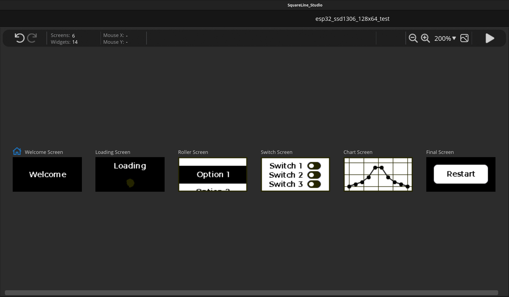

# ESP32 SSD1306 128x64 OLED Screen Example

## Overview
This example uses the [esp32_ssd1306_128x64](../../boards/esp32_ssd1306_128x64) board to demonstrate some of available
LVGL widgets, available via the SquareLine Studio.

## Fonts
The built-in LVGL Montserrat 14 font didn't look the best so I downloaded the 
[Montserrat SemiBold](https://fonts.google.com/specimen/Montserrat#:~:text=Medium%20500%20Italic-,SemiBold%20600,-Whereas%20recognition%20of)
font and [converted](./ui/fonts/ui_font_MontserratSemiBold14.c) it via SquareLine Studio (1bpp).
## Demonstration
